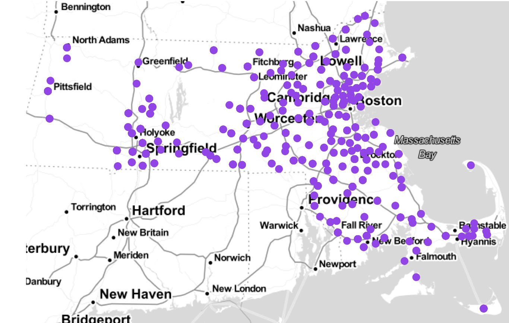
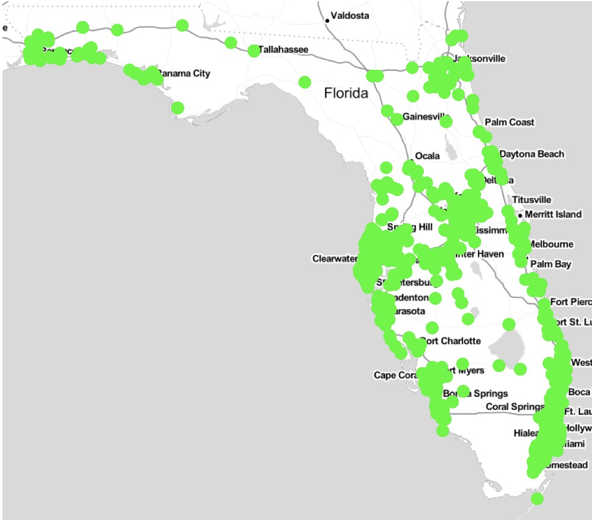
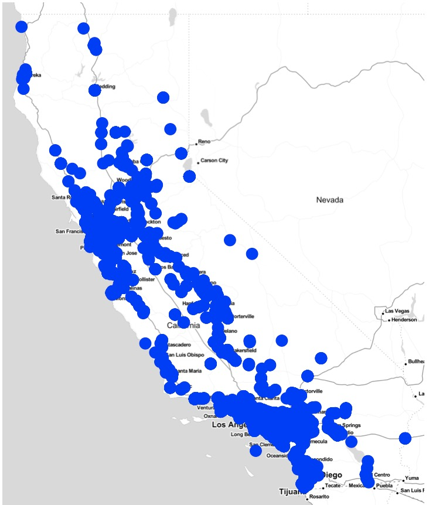
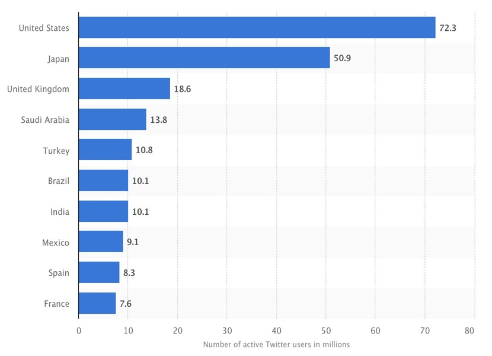
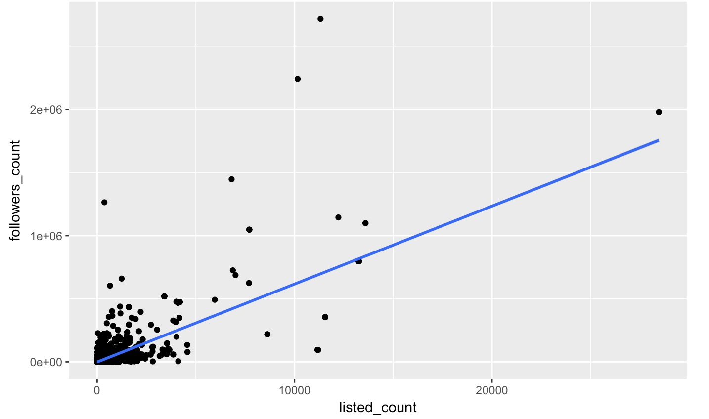

---
title: "Twitter Density Analysis <br>
 <br> "
author: "Michael Rojas"
date: "May 6, 2018"
output: 
    ioslides_presentation: 
      widescreen: yes

---

```{r setup, include=FALSE}
knitr::opts_chunk$set(echo = FALSE)
```
## Slide Layout

* Summary Report.   
* Data Cleaning  
* Geolocation Analysis.  
    + MA.   
    + NY.
    + FL.   
    + CA.
* Leading Country Twitter Usage
* Twitter Stats & Demographics.
* Followers Analysis*
* Twitter Stats Vid
* Conclusion


## Report Summary

This project uses Twitter related packages to analyse word frequencies & Densities of a mass amount of Twitter, compares them among different locations, & finally tries to find some underlying relations of the data.

For the upcoming analysis I will be using 29 sample twitter dataset and each sample includes 5 minutes' twitter within an specific hour (from the last hour of 30 April to the fourth hour of 1 May (Est)).
 <br><br> <br> <br><br> <br>

## Report Summary Cont..

As mentioned in the previous slide I will be grabbing 29 datasets each containing 300 seconds worth of tweets. The filter used are the region within United States "(-125, 25, -66, 50)". In order to 100% accurately do this analysis of Twitter It would be ideal to continuously be grabbing 24 hours worth of Twitter data but that of course will definitely overflow my RAM and ruin my computer, thus my strategy is capturing a 300 seconds (5 minutes) interval sample for each hour of the day.

## Data Cleaning:

We merge all the subdatasets and add time_mark (for further adjustment of time-zone error, and geolocation analysis), clean the datasets, filter out sub-datasets for five states (MA, NY, FL, CA).

We imported all the datasets into R, and marked them with different labels of their belonging hours, such as, 0, 1, 2, 3, ... , 28, each represents 23:00 ~ 23:59 of 29 Apr, 00:00 ~ 00:59 of 30 Apr, etc.


## Geolocation Analysis

First of all, we want to generate an interactive distribution plot of all twitters using ShinyApp to show the trend of all twitter's distribution within the continent of United States through timeline in one day(and a little more at both tails).

After that we also plot the Twitter activity in MA, NY, FL and CA respectively. Which will be provided in the Data visualization slides coming up.


## Ma Tweet Analysis

The following plot represents a Summary of the tweet density in Massachusetts as mentioned before We imported all the datasets into R, and marked them with different labels of their belonging hours, such as, 0, 1, 2, 3, ... , 24, each represents 23:00 ~ 23:59 of 29 Apr, 00:00 ~ 00:59 of 30 Apr, etc. Each green marker represents the average density for that time period. Starting off with MA first then NY,FL, and CA



## NY Tweet Analysis

The following plot represents a Summary of the tweet density in Massachusetts as mentioned before We imported all the datasets into R, and marked them with different labels of their belonging hours, such as, 0, 1, 2, 3, ... , 24, each represents 23:00 ~ 23:59 of 29 Apr, 00:00 ~ 00:59 of 30 Apr, etc. Each green marker represents the average density for that time period.


## FL Tweet Analysis

The following plot represents a Summary of the tweet density in Massachusetts as mentioned before We imported all the datasets into R, and marked them with different labels of their belonging hours, such as, 0, 1, 2, 3, ... , 24, each represents 23:00 ~ 23:59 of 29 Apr, 00:00 ~ 00:59 of 30 Apr, etc. Each green marker represents the average density for that time period.Starting off with MA first then NY,FL, and CA



## CA Tweet Analysis

The following plot represents a Summary of the tweet density in Massachusetts as mentioned before We imported all the datasets into R, and marked them with different labels of their belonging hours, such as, 0, 1, 2, 3, ... , 24, each represents 23:00 ~ 23:59 of 29 Apr, 00:00 ~ 00:59 of 30 Apr, etc. Each green marker represents the average density for that time period.Starting off with MA first then NY,FL, and CA




## Leading Countries Using Twitter 2018

This statistic shows a prognosis of the number of active Twitter users in leading markets as of April 2018. During this period of time, the microblogging service had 10.1 million monthly active users in India. The United States were ranked first with 72.3 million monthly active users. As of the fourth quarter of 2017, Twitter had 330 million global MAU. The most-followed Twitter accounts include celebrities such as Katy Perry, Justin Bieber and former U.S. president Barack Obama.



## Twitter Stats

Total Monthly Active Twitter Users:             | Total Tweets sent per Day: 
----------------------------------------------  | ---------------------------------------------
330 million                                     | 500 million

<br> 
<br>

Percentage of Twitter users on Mobile:          | Number of Twitter Daily Active Users: 
----------------------------------------------  | ---------------------------------------------
80%                                             | 100 million


## Twitter Demographics
 
24% of All Internet male users use Twitter, whereas 21% of All Internet Female users use Twitter. 
There are over 67 million Twitter users in US.
The top three countries by user count outside the U.S. are Brazil (27.7 million users), Japan (25.9 million), and Mexico (23.5 million).
79% of Twitter accounts are based outside the United States
Total number of Twitter users in UK is 13 million.
37% of Twitter users are between ages of 18 and 29, 25% users are 30-49 years old.
56% of Twitter users $50,000 and more in year.


<br>
<br> 

## Followers

Follower counts have long provided a decent indicator of a Twitter account's popularity - though they are relatively easily gamed if you put your mind to it. This is obviously another indicator of popularity - the more lists you are on, the more popular you probably are. In turn, one would guess that in most cases there is a high correlation between how many followers an account has, and how many lists they are on. Depicted below are pair plots of these variables where I calculate the correlation amony them. From the output, followers count and listed count have strong linear relation and friends count also have slight linear relation with these two variables.




## Twitter Stats

<iframe width="415" height="300" src="https://www.youtube.com/embed/qs6S1QEbQlY" frameborder="0" allow="autoplay; encrypted-media" allowfullscreen></iframe>

## Conclusion
In this Twitter data analysis project, (how to get the data and clean the data) I analyze the number of tweets and the density of tweets that are posted in different states and cities, making some plots to compare in different situations. I also use t test and permutation test to check the whether MA and FL have the same density mean in one day. Next, I find the relations among followers count, liseted count and friends count which could represent the popularity in Twitter. Finally, I plot the most frequent words with their wordcloud and conduct clustering analysis on the text data.

